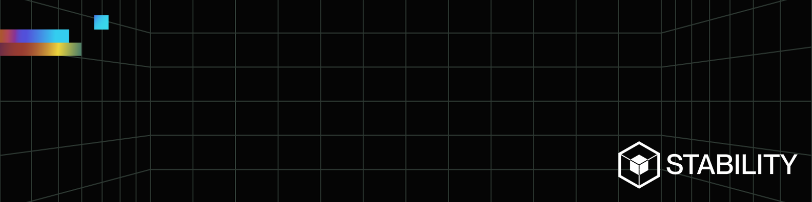

Implementation of Stability blockchain in Substrate + Rust, a scalability solution for accessing the gas market.

- ⛓️ Read more about [Stability Protocol](https://stabilityprotocol.com)
- 📖 Find more resources in our [Documentation](https://stability.readme.io/docs)
- 🐦 Follow us in [Twitter](https://twitter.com/stabilityinc)

## Build & Run

To build the chain, execute the following commands from the project root:

```
$ cargo build --release
```

To execute the chain, run:

```
$ ./target/release/stability --dev
```

The node also supports to use manual seal (to produce block manually through RPC).
This is also used by the ts-tests:

```
$ ./target/release/stability --dev --manual-seal
```

For using a Dockerized solution you can follow the [instructions](docker/README.md) under the `docker/` folder.

## Architecture

The Stability Substrate chain is based on `polkadot-v0.9.36` using the `frontier` layout.
For building this chain, the next pallets have been imported:

- Consensus: _AuRa, GRANDPA_
- EVM: _pallet-evm, pallet-ethereum, pallet-dynamic-fee_
- Substrate: _balances, session, timestamp, collective, im-online_
- Moonbeam: _precompile-utils, balances-erc20_
