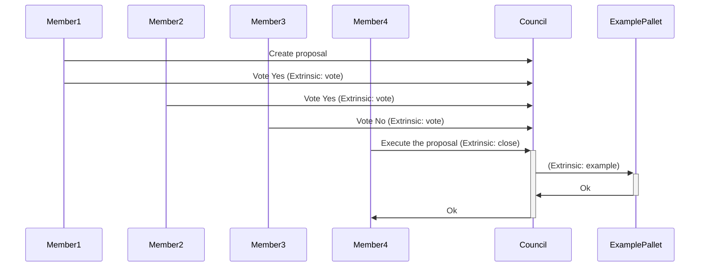
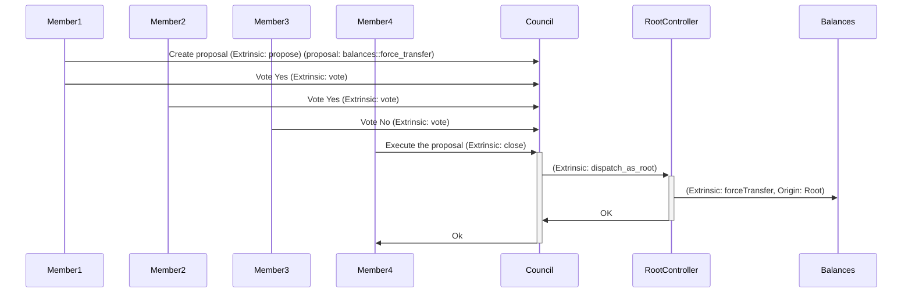

# Council

# Table of contents

1. [Introduction](#introduction)
2. [How to use](#how-to-use)
   1. [Check that the origin is the council](#check-that-the-origin-is-the-council)
   2. [Create a proposal](#create-a-proposal)
   3. [Vote a proposal](#vote-a-proposal)
   4. [Execute the proposal](#execute-the-proposal)
   5. [Flow example](#flow-example)
3. [Use root](#use-root)

## Introduction

The council is a way to distribute the responsibility for some actions among multiple accounts. For example, to add a new validator to the network. If we did not have the council, a single private key would have that responsibility, being likely to be lost at some point, or be misused intentionally by its knowers. For this reason, a council mechanism is highly recommended.

In Stability, we use the [pallet collective](https://paritytech.github.io/substrate/master/pallet_collective/index.html) of substrate to do this mechanism.

## How to use

### Check that the origin is the council

In the places where we want the council to have control, we will have to provide a struct that implements the `EnsureOrigin` trait:

    - EnsureMember (Check that the origin is a member of the council).
    - EnsureMembers<n> (Checks that the origin is the council through a proposal with approved by at least n members)
    - EnsureProportionMoreThan<n, d> (Check that the origin is the council through a proposal with approved by more than n/d parts of the council members)
    - EnsureProportionAtLeast<n, d> (Check that the origin is the council through a proposal with approval by at least n/d parts of the council members)

An example of how to define would be:

```rs
pallet_collective::EnsureProportionAtLeast<AccountId, TechCommitteeInstance, 1, 2>;
```

Here we are defining a struct that implements the `EnsureOrigin` trait and that needs that at least 50% (1/2) of the council members have approved the proposal.

### Create a proposal

**1. Click "Extrinsics"**


**2. Click here.**


**3. Select a council. In our example the TechCommittee**


**4. Click here.**


**5. Click here.**


**6. Set the threshold which is the number of voters at which the proposal can be closed.**


**7. Select the extrinsic you want to call from this proposal. In this example we will call the dispatchAsRoot of the rootController pallet.**


**8. Set lenghtbound. The lenghtbound is a parameter used to control the amount of gas used. The amount of gas does not depend on the lenghtbound, it depends on the byte size of the call, but to limit the amount of gas the lenghtbound parameter must be greater than the number of bytes in the call.**


**9. Sign and submit the extrinsic**


### Vote a proposal

**1. To vote on a proposal. Go to the blockchain events and look for the `Proposed` event of your council instance. You will need to copy the proposalHash and the index.**


**2. Click "Extrinsics"**


**3. Click here.**


**4. Select a council. In our example the "TechCommittee"**


**5. Click here.**


**6. Choose the extrinsic "vote"**


**7. Paste the "proposalHash" of the proposal you want to vote on.**


**8. Paste the "index" of the proposal you want to vote on.**


**9. Indicate whether you want to vote for or against**


**10. Sign and submit the extrinsic**


### Execute the proposal

**1. Click "Extrinsics"**


**2. Click here.**


**3. Click here.**


**4. Paste the proposal hash**


**5. Set the index of the proposal**


**6. Set the `proposalWeighBound` which is the maximum weight to be spent by the dispatch linked to the proposal.**


**7. Set lenghtBound. The lenghtBound is a parameter used to control the amount of gas used. The amount of gas does not depend on the lenghtBound, it depends on the byte size of the call, but to limit the amount of gas the lenghtbound parameter must be greater than the number of bytes in the call.**


**8. Click "Submit Transaction"**


**9. Click "Sign and Submit"**


### Flow example



## Use root

To be able to use parts of the code with root from the council in Stability we have created the RootController pallet, which allows to call from the `dispatch_as_root` extrinsic to another extrinsic with root as long as the origin of the call to `dispatch_as_root` is from a TechCommitteeInstance council proposal with at least 50% of the members approving this proposal as you can see here:

`runtime/src/lib.rs`

```rs
impl pallet_root_controller::Config for Runtime {
    type ControlOrigin =
        pallet_collective::EnsureProportionAtLeast<AccountId, TechCommitteeInstance, 1, 2>;
    type RuntimeCall = RuntimeCall;
    type RuntimeEvent = RuntimeEvent;
}
```

For example, to call the `forceTransfer` extrinsic, which is an extrinsic that requires the origin to be root, we must follow the following flow:


