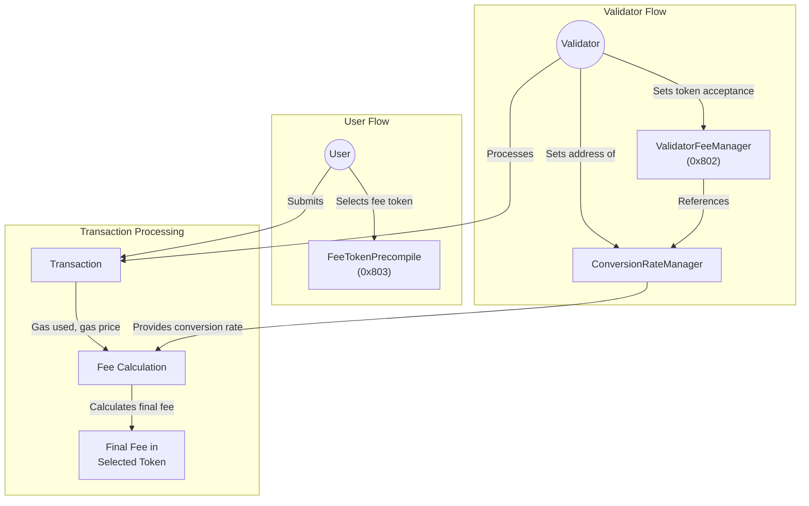

# Decentralized native token

Stability has no native token in the way that there is no emitted token by Stability. Instead, Stability implements a decentralized native token in which the user and the validator will select the token for which the transaction fees will be paid/received. The available fee tokens the user can pay is whitelisted.

# How does the user select the token?

Stability users should select the token in which the fees are to be paid. If no token is specified, the default token will be chosen. For calculating the transaction fee in the fee token, a conversion rate decided by the validator is applied to the native units. For example, the native gas price is 50 gwei, and the fee will be paid in USDC with a 1.2x of conversion rate, so `gas_price = 50 * 1.2 / 1e18 = 0.00000006 USDC`. The Total Fee math would be `total_fee = gas_used * (base_fee + priority_fee) * conversion_rate`, and for the Gas Price `gas_price = (base_fee + priority_fee) * conversion_rate`.

To select the token, the user has to interact with `FeeTokenPrecompile` at `0x0000000000000000000000000000000000000803`.

Though a user can select the token in which the fees are paid, this doesn't mean that the experience in every fee token is the same within Stability. For instance, if the user selects a fee token with an acceptance rate of 20%, its effective block time would be `2 seconds / 20% = 10s`.

# How does the validator select the token?

Stability validators have to select which tokens want to accept as fees. The validators can accept all the allowed fee tokens though they will only accept the default token at first. There is no need for the validators to accept the default token, but they should update their acceptance of this token. Along with the token acceptance, the validator should set up the conversion rate of the token that will be used when a user selects this token to pay the fees. This conversion rate is used for mapping from our internal fee units to the selected fee token.

To select the token and its conversion rate, the user has to interact with `ValidatorFeeManagerPrecompile` at `0x0000000000000000000000000000000000000802`. Token acceptance is directly set by the validator but token conversion rate is not directly set in this contract, instead what the validator sets is the address of a convesion rate manager.

Actual transaction fees (in fee token units) would be: `gasUsed * transactionGasPrice * token_fee_conversion_rate` where `token_fee_conversion_rate` is the conversion rate of the selected token for the validator and `transactionGasPrice` is the `gas_price` or `max_fee_per_gas` of the transaction, check the [Fee Calculation logic](/primitives/tools/src/custom_fee.rs) for more information.

### How to create a conversion rate manager?

A conversion rate manager is a smart contract that implements the following interface.

```solidity
pragma solidity =0.6.6;

interface IConversionRateManager {
     function getConversionRate(address /*sender*/, address/*validator*/, address token) external view returns(uint256, uint256);
}
```

This function is called every time a transaction is sent to the blockchain and used the result to calculate the actual DNT fees. The default conversion rate manager is `0x444212d6E4827893A70d19921E383130281Cda4a`.

## Flowchart


