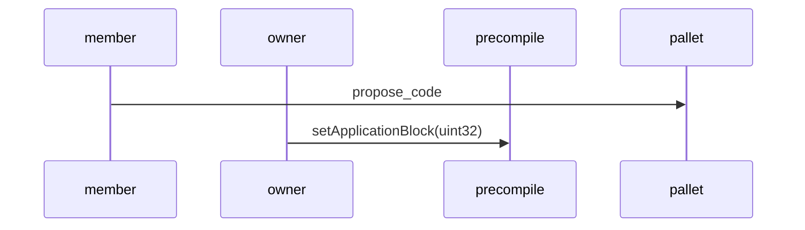
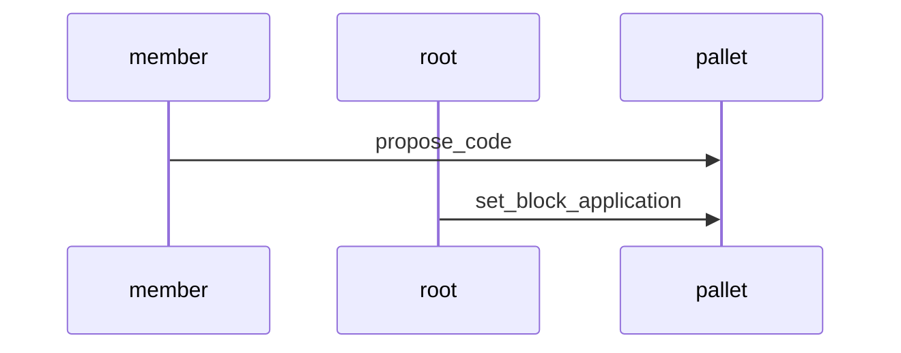

# UPGRADE RUNTIME

Substrate has its method to upgrade the runtime. Stability has built some tools for upgrading the runtime easier.

You can read the guide to upgrade a substrate based chain [here](https://docs.substrate.io/tutorials/get-started/upgrade-a-running-network/)

# Table of contents

1. [Propose code](#propose-code)
2. [Accept proposed code](#accept-proposed-code)
3. [Reject proposed code](#reject-proposed-code)
4. [Upgrade flow](#upgrade-flow)
    1. [Flow using precompile](#flow-using-precompile)
    2. [Flow using only pallet](#flow-using-only-pallet)

## PROPOSE CODE

Stability has created the pallet `pallet-upgrade-runtime-proposal` to allow any member of the `TechCommittee` to propose a code. To propose a code a member of the `TechCommittee` has to submit the extrinsic `propose_code`. 

## ACCEPT PROPOSED CODE

There is no method to accept a proposed code and apply it immediately. To accept the proposed code, a block in which the code must be applied must be submitted. Stability has created two methods to accept a proposed code. The first method uses the extrinsic `set_block_application` from `pallet-upgrade-runtime-proposal` using root origin. The other way is using the EVM precompile `precompile-upgrade-runtime-controller` in the address `0x0000000000000000000000000000000000000806` calling the function `setApplicationBlock(uint32)`. `setApplicationBlock(uint32)` must be called from the owner address.

## REJECT PROPOSED CODE

There are two methods to reject a proposed code. The first method uses the extrinsic `reject_proposed_code` from `pallet-upgrade-runtime-proposal` using root origin. The other way is using the EVM precompile `precompile-upgrade-runtime-controller` in the address `0x0000000000000000000000000000000000000806` calling the function `rejectProposedCode()`. `rejectProposedCode()` must be called from the owner address.

## UPGRADE FLOW

- *member*: `TechCommittee` member
- *owner*: `precompile-upgrade-runtime-controller` owner
- *precompile*: `precompile-upgrade-runtime-controller`
- *pallet*: `pallet-upgrade-runtime-proposal`

### FLOW USING PRECOMPILE

### FLOW USING ONLY PALLET

