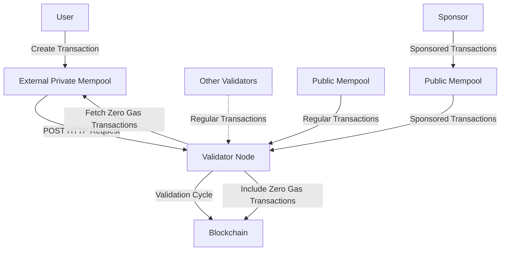

# Zero Gas Transactions

- [1. Introduction](#1-introduction)
- [2. How do Zero Gas Transactions work?](#2-how-do-zero-gas-transactions-work)
  - [External Private Mempool](#external-private-mempool)
  - [Setting up the External Mempool for Validators](#setting-up-the-external-mempool-for-validators)
- [3. Other considerations](#3-other-considerations)
- [4. Diagram](#4-diagram)

## 1. Introduction

Zero Gas Transactions represent an innovative type of transaction developed in Stability. Their main appeal lies in their ability to execute without incurring gas fees. Moreover, these transactions are stored in a private mempool, separate from the network's validating nodes.

This system contrasts with [Sponsored Transactions](SPONSORED-TRANSACTIONS.md), where, even if the user doesn't pay, a third entity named "sponsor" assumes the execution costs. In the case of Zero Gas Transactions, the gas fee is nil for all parties involved. This is because the validator itself, when mining the transaction, decides to include it during its validation cycle, resulting in a gas fee of 0.

## 2. How do Zero Gas Transactions work?

The mechanism underlying Zero Gas Transactions is relatively straightforward. As mentioned earlier, the validator is responsible for selecting and processing these no-cost transactions during their validation cycle.

### External Private Mempool

The validator selects the transactions from an external private mempool. This mempool is a service that exposes a POST HTTP interface and returns a list of transactions with the following format:

```json
{
  "transactions": [
    "..." // signed Ethereum transaction in hexadecimal format without the 0x prefix
  ]
}
```

All transactions retrieved from this mempool will be processed as Zero Gas Transactions.

### Setting up the External Mempool for Validators

If you are a validator and wish to integrate this functionality, you simply need to configure your node with the `--zero-gas-tx-pool <URL>` parameter. This option determines the HTTP address to which the validating node will make POST requests to obtain the Zero Gas Transactions during its validation cycle.

## 3. Other considerations

- If the external mempool takes longer than 100ms to respond, the Zero Gas Transactions will be ignored.
- If the JSON format returned by the external private mempool is incorrect, the transactions will be ignored.
- It is essential that, to be processed as a Zero Gas Transaction, the `gasPriceLimit` parameter is set to 0.

## 4. Diagram


