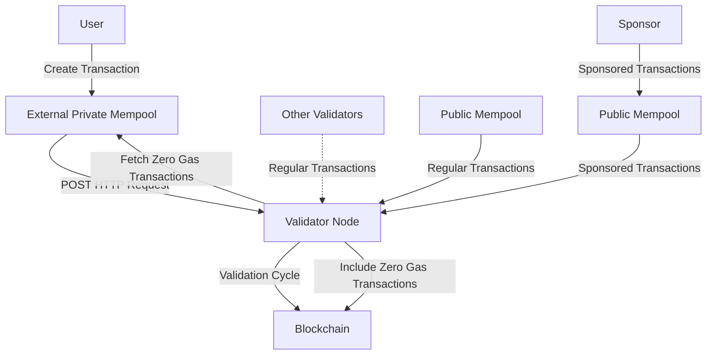
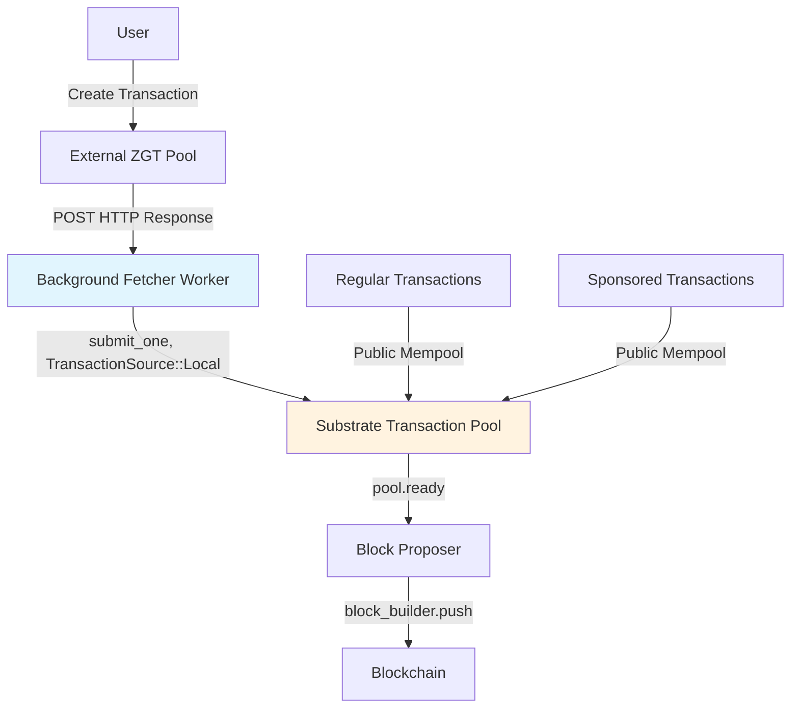
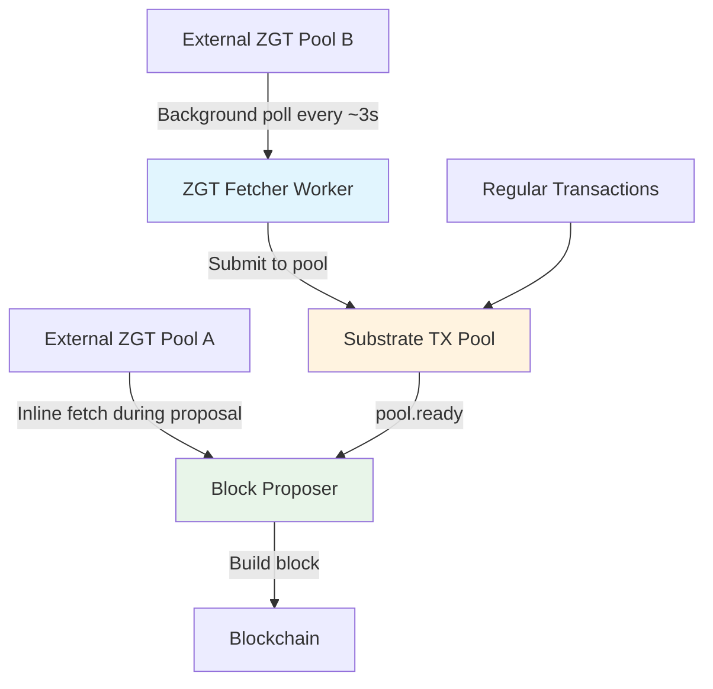

# Zero Gas Transactions

- [1. Introduction](#1-introduction)
- [2. How do Zero Gas Transactions work?](#2-how-do-zero-gas-transactions-work)
  - [External Private Mempool](#external-private-mempool)
  - [Setting up the External Mempool for Validators](#setting-up-the-external-mempool-for-validators)
- [3. Mempool Enqueue Mode (Background Fetcher)](#3-mempool-enqueue-mode-background-fetcher)
  - [How it works](#how-it-works)
  - [Setting up the Enqueue Mode](#setting-up-the-enqueue-mode)
  - [Validator Consent Signature and Block Window](#validator-consent-signature-and-block-window)
  - [Running Both Modes Simultaneously](#running-both-modes-simultaneously)
- [4. Other considerations](#4-other-considerations)
- [5. CLI Reference](#5-cli-reference)
- [6. Diagrams](#6-diagrams)

## 1. Introduction

Zero Gas Transactions represent an innovative type of transaction developed in Stability. Their main appeal lies in their ability to execute without incurring gas fees. Moreover, these transactions are stored in a private mempool, separate from the network's validating nodes.

This system contrasts with [Sponsored Transactions](SPONSORED-TRANSACTIONS.md), where, even if the user doesn't pay, a third entity named "sponsor" assumes the execution costs. In the case of Zero Gas Transactions, the gas fee is nil for all parties involved. This is because the validator itself, when mining the transaction, decides to include it during its validation cycle, resulting in a gas fee of 0.

## 2. How do Zero Gas Transactions work?

The mechanism underlying Zero Gas Transactions is relatively straightforward. As mentioned earlier, the validator is responsible for selecting and processing these no-cost transactions during their validation cycle.

### External Private Mempool

The validator selects the transactions from an external private mempool. This mempool is a service that exposes a POST HTTP interface and returns a list of transactions with the following format:

```json
{
  "transactions": [
    "..." // signed Ethereum transaction in hexadecimal format without the 0x prefix
  ]
}
```

All transactions retrieved from this mempool will be processed as Zero Gas Transactions.

### Setting up the External Mempool for Validators

If you are a validator and wish to integrate this functionality, you simply need to configure your node with the `--zero-gas-tx-pool <URL>` parameter. This option determines the HTTP address to which the validating node will make POST requests to obtain the Zero Gas Transactions during its validation cycle.

In this mode (the **inline** mode), the node fetches transactions from the external pool **synchronously during block proposal**. The HTTP request happens on the critical path of block production, subject to the configured timeout.

## 3. Mempool Enqueue Mode (Background Fetcher)

An alternative mode decouples the HTTP fetch from block production by running a **background worker** that polls the external pool and submits zero-gas transactions into the standard **Substrate transaction pool (mempool)**. The block proposer then picks them up naturally alongside regular transactions.

This mode eliminates the latency impact of the HTTP fetch on block production, making the system faster and more resilient to external pool slowness or unavailability.

### How it works

1. A background task polls the configured HTTP endpoint at a regular interval (default: every 3 seconds).
2. Fetched transactions are decoded, deduplicated, and wrapped into unsigned extrinsics.
3. The validator signs a consent message (proving it agrees to include zero-gas transactions) and attaches the signature to each extrinsic.
4. Each extrinsic is submitted to the local Substrate transaction pool via `TransactionSource::Local`.
5. During the next block proposal, the proposer picks up these transactions from `pool.ready()` like any other transaction.
6. Full consent signature validation happens during block execution, ensuring security is preserved.

### Setting up the Enqueue Mode

Configure your node with the `--zero-gas-tx-pool-enqueue <URL>` parameter:

```bash
stability \
  --zero-gas-tx-pool-enqueue http://your-zgt-pool:8080/transactions \
  --zero-gas-tx-pool-enqueue-interval 3000 \
  --zero-gas-tx-pool-timeout 1000
```

| Parameter | Description | Default |
|-----------|-------------|---------|
| `--zero-gas-tx-pool-enqueue <URL>` | HTTP URL of the external pool for the background fetcher | _(none, disabled)_ |
| `--zero-gas-tx-pool-enqueue-interval <MS>` | Poll interval in milliseconds | `3000` |
| `--zero-gas-tx-pool-timeout <MS>` | HTTP request timeout in milliseconds (shared with inline mode) | `1000` |

### Validator Consent Signature and Block Window

The validator signs a consent message of the form:

```
I consent to validate zero gas transactions in block {N} on chain {chain_id}
```

Since the background fetcher signs for `best_block + 1` but the transaction may be included several blocks later, the pallet accepts consent signatures within a **±10 block window**. This means a signature signed for block 50 is valid for execution at any block from 40 to 60.

During pool validation (`TransactionSource::Local` or `External`), the consent signature check is skipped entirely — only the Ethereum transaction signature and nonce/chain-id checks are performed. The full consent validation is deferred to block execution time, where `block_number()` and `find_author()` return correct values.

Transactions submitted to the pool have a **longevity of 20 blocks**, after which they are automatically evicted if not included in a block. The background fetcher will re-fetch and re-submit fresh transactions in subsequent poll cycles.

### Running Both Modes Simultaneously

Both modes can run at the same time with **different endpoints**:

```bash
stability \
  --zero-gas-tx-pool http://pool-a:8080/inline \
  --zero-gas-tx-pool-enqueue http://pool-b:8080/enqueue \
  --zero-gas-tx-pool-timeout 1000 \
  --zero-gas-tx-pool-enqueue-interval 3000
```

| Mode | Flag | Behavior |
|------|------|----------|
| Inline | `--zero-gas-tx-pool` | HTTP fetch during block proposal (original behavior) |
| Enqueue | `--zero-gas-tx-pool-enqueue` | Background fetcher submits to Substrate mempool |
| Both | Both flags set | Both paths run simultaneously |

## 4. Other considerations

- If the external mempool takes longer than the configured timeout (default: 1000ms) to respond, the transactions will be ignored for that cycle.
- If the JSON format returned by the external private mempool is incorrect, the transactions will be ignored.
- It is essential that, to be processed as a Zero Gas Transaction, the `gasPriceLimit` parameter is set to 0.
- In enqueue mode, transactions are deduplicated by their Ethereum transaction hash. Duplicate transactions seen within the last 25 blocks are skipped.
- Zero-gas transactions submitted to the Substrate pool have `priority = u64::MAX`, ensuring they are included before regular transactions.

## 5. CLI Reference

| Flag | Description | Default |
|------|-------------|---------|
| `--zero-gas-tx-pool <URL>` | HTTP URL for inline fetch during block proposal | _(none)_ |
| `--zero-gas-tx-pool-timeout <MS>` | HTTP timeout for both modes | `1000` |
| `--zero-gas-tx-pool-enqueue <URL>` | HTTP URL for background enqueue mode | _(none)_ |
| `--zero-gas-tx-pool-enqueue-interval <MS>` | Poll interval for enqueue mode | `3000` |

## 6. Diagrams

### Inline Mode (Original)


```mermaid
graph TD;
  A[User] -->|Create Transaction| B[External Private Mempool]
  B -->|POST HTTP Request| C[Validator Node]
  D[Other Validators] -.->|Regular Transactions| C
  E[Public Mempool] -->|Regular Transactions| C
  C -->|Fetch Zero Gas Transactions| B
  C -->|Validation Cycle| F[Blockchain]
  G[Sponsor] -->|Sponsored Transactions| H[Public Mempool]
  H -->|Sponsored Transactions| C
  C -->|Include Zero Gas Transactions| F
```

### Enqueue Mode (Background Fetcher)


```mermaid
graph TD;
  A[User] -->|Create Transaction| B[External ZGT Pool]
  B -->|POST HTTP Response| C[Background Fetcher Worker]
  C -->|submit_one, TransactionSource::Local| D[Substrate Transaction Pool]
  D -->|pool.ready| E[Block Proposer]
  E -->|block_builder.push| F[Blockchain]
  G[Regular Transactions] -->|Public Mempool| D
  H[Sponsored Transactions] -->|Public Mempool| D

  style C fill:#e1f5fe
  style D fill:#fff3e0
```

### Combined Architecture


```mermaid
graph TD;
  A[External ZGT Pool A] -->|Inline fetch during proposal| B[Block Proposer]
  C[External ZGT Pool B] -->|Background poll every ~3s| D[ZGT Fetcher Worker]
  D -->|Submit to pool| E[Substrate TX Pool]
  E -->|pool.ready| B
  F[Regular Transactions] --> E
  B -->|Build block| G[Blockchain]

  style D fill:#e1f5fe
  style E fill:#fff3e0
  style B fill:#e8f5e9
```
